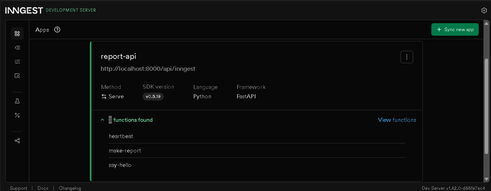
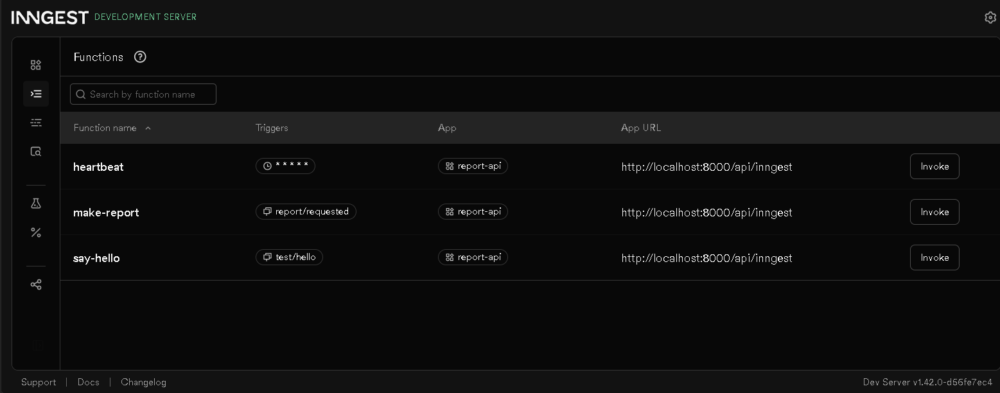
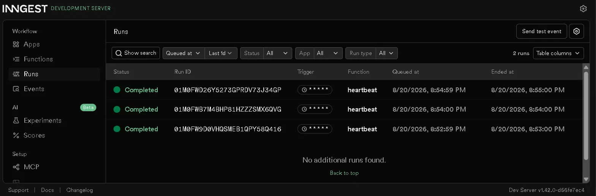

# Inngest Server Background Job — Report API

A small FastAPI service that demonstrates the background job pattern: accept fast,
work in the background, report status. Built with [Inngest](https://www.inngest.com/)
for background jobs, retries, and a cron-scheduled job.

- `POST /reports` answers instantly (`202 Accepted`) instead of making the client
  wait for an 8-second report to be generated.
- `GET /reports/{id}` lets the client poll for status (`pending` → `done`).
- A `heartbeat` cron job runs every minute, independent of any request, and logs a
  summary of report statuses.

## How to run it

Two terminals, two commands.

**Terminal 1 — the API**
```bash
uvicorn app.main:app --port 8000
```

**Terminal 2 — the Inngest Dev Server**
```bash
npx inngest-cli@latest dev -u http://localhost:8000/api/inngest
```

Then open the dashboard at [http://localhost:8288](http://localhost:8288) to watch
functions run.

## Endpoints & functions

| Type | Name | Trigger | Description |
|---|---|---|---|
| Endpoint | `GET /health` | HTTP request | Health check, returns `{"status": "ok"}` |
| Endpoint | `POST /reports` | HTTP request | Accepts `{"topic": "..."}`, returns `202` + `id` instantly, kicks off background work |
| Endpoint | `GET /reports/{id}` | HTTP request | Returns the report's current status (`pending`/`done`) and result once ready; `404` if unknown |
| Function | `say-hello` | Event `test/hello` | Test function from Stage 1, sleeps 5s |
| Function | `make-report` | Event `report/requested` | Background job: sleeps 8s (`do-the-slow-work`), then builds and saves the result (`build-report`). Retries twice on failure. |
| Function | `heartbeat` | Cron `* * * * *` | Runs every minute, logs a count of pending/done/failed reports |

## Proof: 202 then poll

```
$ curl -i -X POST http://localhost:8000/reports -H "Content-Type: application/json" -d "{\"topic\":\"cats\"}"
HTTP/1.1 202 Accepted
content-type: application/json

{"id":"1a2619d5-3a16-466d-8f3a-c3236441b3e7","status":"pending"}

$ curl -i http://localhost:8000/reports/1a2619d5-3a16-466d-8f3a-c3236441b3e7
HTTP/1.1 200 OK
content-type: application/json

{"id":"1a2619d5-3a16-466d-8f3a-c3236441b3e7","topic":"cats","status":"done","result":"Report about 'cats' is ready."}
```

The `POST` returns in milliseconds. The report itself takes ~8 seconds to finish
in the background, and the second poll shows `status: "done"` with the result.

## retries vs. validation

A retry is for a transient failure — the same input might succeed next time — but
bad input like a missing `topic` will fail every time, so it's rejected immediately
at the door (`400`) instead of wasting a retry.

**Checkpoint:** a report with `topic: "fail"` shows 3 attempts in the dashboard
(increasing delay between each — backoff) and ends `Failed`. A `POST /reports`
with no `topic` returns `400` and creates no job.


## Stage 4 — cron

- Every day at 08:00: `0 8 * * *`
- Every Sunday at 22:00: `0 22 * * 0`

**Checkpoint:** the dashboard shows multiple `heartbeat` runs, one minute apart,
each `Completed`.

## Dashboard screenshot




## Notes

- Data is stored in-memory (a plain Python dict) — it resets when the server
  restarts. This mirrors earlier assignments in the program; a real service would
  use a database.
- The Inngest Dev Server and dashboard run locally with no account required.
